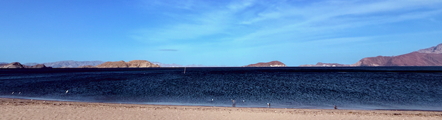

The roads in Baja are teaching me patience. After more than a week of traveling here, I'm becoming accustomed to maintaining focus while navigating these narrow passages. The most important lesson of driving in Mexico seems deceptively simple: just take your time. People will pass if they need to, and worrying about your speed won't get you anywhere faster or safer.

This principle of patience extends beyond driving. Before we left Colorado, I was anticipating this trip with excitement but also uncertainty about how I'd adapt to a less structured existence. The transition from a corporate mindset to travel mode doesn't happen overnight. Even in paradise, I've found myself questioning how to measure the value of my days. Is setting up a fly rod an accomplishment? Should I be doing more? These questions reflect the challenge of shedding productivity metrics that define our working lives.

Meanwhile, the world continues its chaotic spin. The stock market has been reacting dramatically to Trump's new tariff plan, affecting our portfolio along with countless others. While we're financially secure, we've decided to postpone building a new rental house until next year. We likely will still move forward with my new garage/shop, but tackling both projects would stretch our savings too thin in an uncertain economy.

This economic backdrop creates an interesting contrast with what I'm observing in Mexico. The people here seem genuinely connected to their surroundings and community in ways that many Americans aren't. There's a noticeable difference in priorities. The concept of abundance keeps surfacing in my thoughts. While many Americans operate from a zero-sum, winner-takes-all mentality, the people I've met here seem more relaxed, less focused on climbing to the next level. It's refreshing.

An article I read in [Overland Journal](https://overlandjournal.com/) reinforced this idea, discussing how our Western obsession with security—physical, financial, medical—can actually limit our freedom. People throughout history and across the globe live with far fewer safety nets than we consider essential, and they manage just fine. Though we're hardly roughing it in our comfortable truck, there's something valuable about the self-sufficiency required by this type of travel.

"Control what you are able to control" has become my mantra. We can't influence national policies or the stock market's reaction, but we can adjust our spending, prioritize our projects, and find contentment in changed circumstances. We had originally planned to visit Costa Rica this fall, but returning to Baja might make more sense financially. The warmer weather would make for better snorkeling, too. There are positives in everything if we look for them.

For now, I'm working on staying present and not getting pulled into the social media outrage cycle. It's too easy to seek out voices that simply echo and amplify our existing thoughts. Instead, I'm trying to take in the beauty around me and appreciate how fortunate I am to have this opportunity to step away from the corporate world and simply enjoy life.

The balance between planning for an uncertain future and savoring the present moment might be the most valuable skill to cultivate, whether in Baja or back home. While paddleboarding on a perfect day, I had to pause and remind myself of this truth—to fully experience the moment rather than worrying about how I'm spending every minute. Perhaps that's the real accomplishment of travel: learning to be where you are.
